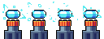
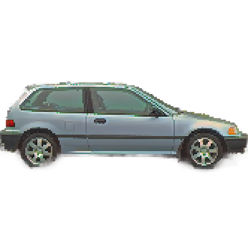
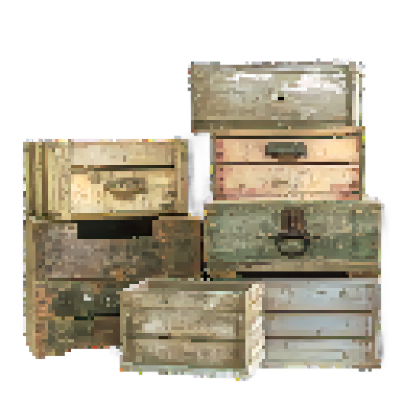
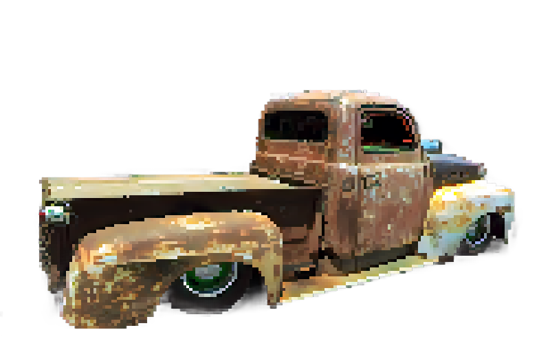
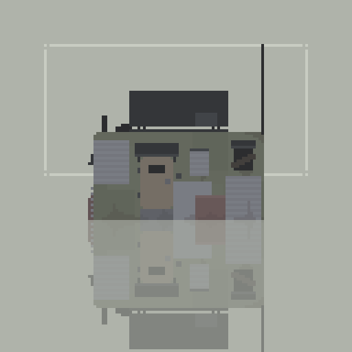

# Death Journey

## 🎮 Game Design

### 📝 Introduction
**Death Journey** is a thrilling 2D pixelated platformer where players control Adam, on his journey to explore the complex mystery of his girlfriend, Maria. Battling through hordes of zombies, vampires, and werewolves, Adam must uncover dark mysteries and upgrade his weapons to survive.

## 👥 Contributors

- **Lê Quang Khánh** - SE182420
- **Đào Trọng Đức** - SE180110
- **Nguyễn Phạm Đăng Quang** - SE173601
- **Nguyễn Quang Khánh An** - HE180905
- **Võ Thị Thanh Tâm** - QE180092
  
## Document: https://docs.google.com/document/d/1OWNrMBN8CfisQHNEvSkb0Qcx43pYnOcHSXfo4d43rEo/edit?usp=sharing

## 🕹️ Game Features
- **Fast-paced combat** with a variety of weapons.
- **Multiple environments**, including forests, cities, castles, and hellscapes.
- **Upgradeable abilities** at checkpoints.
- **Diverse enemies**, such as zombies, vampires, and demons.
- **Immersive storyline** with a haunting twist.

## 📖 Story
The protagonist is a young man named Adam, who is on a quest to find his girlfriend - Maria, as she is somewhere strange. While finding his girlfriend Adam discovered some horrible truth of what happened to her.

### 📌 Levels
1. **Prologue:** Adam travels to an unknown place, reads note from Maria and enters a portal.
2. **City of the Dead:** Zombies and deadly traps lurk in a fog-covered city.
3. **Cursed Castle:** A dark fortress filled with werewolves.
4. **The Punishment:** The final level reveals the horrifying truth, hell on earth.

## 🎯 Objective
Survive the journey by defeating enemies, collecting power-ups, and solving mysteries to rescue Maria.

## 🎨 Graphics & Environments
- **Forests** with eerie full-moon settings.
  
   
- **Ruined cities** filled with zombies.
  
   
- **Dark castles** haunted by vampires.
  
   
- **Hellish landscapes** teeming with demons.
  
   

## ⚔️ Gameplay Mechanics

### 🎭 Player Actions
- Jumping, running, crouching, and shooting.
- Collecting power-ups and weapons.
- Upgrading abilities at checkpoints.

### 🔥 Weapons Upgrades
| Weapon | Name | Damage | Fire Rate | Cost |
|--------|------|--------|-----------|------|
|  | Pistol | 1 per shot | 20 RPM | Free |
|  | AK-47 | 1 per shot | 60 RPM | 8000 Money |
|  | Laser Pistol | 2 per shot | 30 RPM | 3000 Money |
|  | Laser Rifle | 1.5 per shot | 80 RPM | 12000 Money |

### 🛡️ Player Upgrades
| Armor | Name | Speed | Health | Cost |
|-------|------|-------|--------|------|
|  | Adam | 5 speed | 100 health | Free |
|  | Soldier | 6.5 speed | 150 health | 6000 Money |
|  | Super Soldier | 8 speed | 200 health | 14000 Money |

### 🧟 Enemy Types
| Enemy | Name | Descriptions | Damage | Speed | Health | Range |
|-------|------|--------------|--------|-------|--------|-------|
|  | Zombie | First monster encountered, durable but weak attacks. | 20 damage | 1 speed | 5 health | 2 range |
|  | Werewolf | Extremely fast, durable, low attack range, beware of its claws. | 30 damage | 3 speed | 10 health | 1.5 range |
|  | Creep | Created from hell, a jester, fast, durable and high range attack. | 20 damage | 2.5 speed | 10 health | 2 range |
|  | Executioner | Born to punished, the Executioner can gives slow but fatal attack with his bladed arm, very durable and high range. | 40 damage | 1.5 speed | 15 health | 3 range |

### ☠️ Traps
| Trap | Name | Descriptions | Damage |
|------|------|--------------|--------|
|  | Zapper | Shock the player to death | 50 damage |
|  | Spikes | A deadly trap, you don't wanna fall into a pit full of this trap | 50 damage |

### 🎒 Pickups
- **Cash** (Buy weapons & upgrades)
- **Ammo Boxes** (Reload weapons)
- **Adrenaline** (Speed boost for 5 sec)
- **Syringes** (Heal 40 HP)
- **Keys** (Unlock new worlds)
- **Notes** (Story clues from Maria)
- **Pills** (Temporary immortality)

| Item | Name | Descriptions | Amount |
|------|------|--------------|--------|
|  | Adam | 5 speed | 100 health | Free |
|  | Soldier | 6.5 speed | 150 health | 6000 Money |
|  | Super Soldier | 8 speed | 200 health | 14000 Money |

### 💬 Interactables
| Props | Name | Descriptions | Item Received |
|-------|------|--------------|---------------|
|  | Car | Interact to get a note from Maria | Maria's Note |
|  | Crates | Interact to get ammo from the crates | Ammo Box |
|  | Old Truck | Interact to get key to the portal | Key |
|  | Save Point | Interact to save game |  |
|  | Store | Interact to access the store, to upgrade or buy items |  |
|  | Portal | Interact to move to the next level, require key |  |

### 📦 Inventory 
- Add Item
- Use Item
- Remove Item
- Check Item Quantity
- Read Item Descriptions

### 🛒 Store
- Buy weapons
- Buy armors
- Buy items (adrenaline, pills, syringe, ammo box)

### 💾 Save 
- Save current level
- Save current weapon
- Save current player
- Save player position
- Save cash
- Save ammo
- Save inventory items

## 🎮 Controls
- **A / D** → Move Left / Right
- **Space** → Jump
- **Ctrl** → Crouch
- **Left Click** → Shoot
- **E** → Interact
- **Tab** → Open Inventory

## 🖥️ User Interface
- **Health Bar** 🩸
- **Ammo Counter** 🔫
- **Money Display** 💰
- **Interaction Prompts** ℹ️

## 🔧 Development Tools
- **Engine:** Unity 2D
- **Graphics:** Pixel art
- **Audio:** Retro-inspired eerie soundtracks

## 🛠️ Team & Development Timeline

### **Roles:**
- **Game Designer:** Mechanics & level design.
- **Programmer:** Implements combat, AI, UI, and interactions.
- **Artist:** Creates pixel art assets.
- **Sound Designer:** Adds immersive audio effects.
- **Writer:** Crafts the storyline & dialogues.

### **Timeline:**
1. **Week 1-2:** Game concept, documentation, prototype.
2. **Week 3-4:** Core mechanics (movement, combat, AI).
3. **Week 5-6:** Level design & asset integration.
4. **Week 7-8:** Playtesting, balancing, improvements.
5. **Week 9-10:** Final bug fixes & release.

## 🚀 Installation & How to Play
1. Clone the repository:
   ```sh
   git clone https://github.com/PRU212-Group2/2D-death-journey.git
   ```
2. Open in Unity 2D.
3. Run the game and start your **Death Journey!**


🔗 **GitHub Repository:** [https://github.com/PRU212-Group2/2D-death-journey]  
