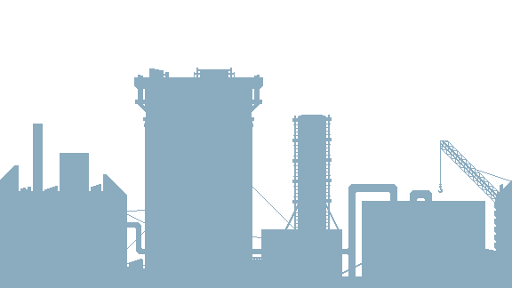

# Death Journey

## 🎮 Game Design

### 📝 Introduction
**Death Journey** is a thrilling 2D pixelated platformer where players control Adam, on his journey to explore the complex mystery of his girlfriend, Maria. Battling through hordes of zombies, vampires, and werewolves, Adam must uncover dark mysteries and upgrade his weapons to survive.

## 👥 Contributors

- **Lê Quang Khánh** - SE182420
- **Đào Trọng Đức** - SE180110
- **Nguyễn Phạm Đăng Quang** - SE173601
- **Nguyễn Quang Khánh An** - HE180905
- **Võ Thị Thanh Tâm** - QE180092
  
## Document: https://docs.google.com/document/d/1OWNrMBN8CfisQHNEvSkb0Qcx43pYnOcHSXfo4d43rEo/edit?usp=sharing

## 🕹️ Game Features
- **Fast-paced combat** with a variety of weapons.
- **Multiple environments**, including forests, cities, castles, and hellscapes.
- **Upgradeable abilities** at checkpoints.
- **Diverse enemies**, such as zombies, vampires, and demons.
- **Immersive storyline** with a haunting twist.

## 📖 Story
Adam's peaceful life is shattered when Maria is abducted by a dark force. To save her, he must battle monstrous creatures across different worlds, uncovering hidden truths along the way.

### 📌 Levels
1. **Prologue:** Adam travels to an unknown place, reads note from Maria and enters a portal.
2. **City of the Dead:** Zombies and deadly traps lurk in a fog-covered city.
3. **Cursed Castle:** A dark fortress filled with werewolves.
4. **The Punishment:** The final level reveals the horrifying truth, hell on earth.

## 🎯 Objective
Survive the journey by defeating enemies, collecting power-ups, and solving mysteries to rescue Maria.

## 🎨 Graphics & Environments
- **Forests** with eerie full-moon settings.
  
   
- **Ruined cities** filled with zombies.
  
   
- **Dark castles** haunted by vampires.
  
   
- **Hellish landscapes** teeming with demons.
  
   
  
## 🎨 Graphics & Environments
- **Forests** with eerie full-moon settings.
- **Ruined cities** filled with zombies.
- **Dark castles** haunted by the sheer amount of guilt.
- **Hellish landscapes** teeming with demons.

## ⚔️ Gameplay Mechanics

### 🎭 Player Actions
- Jumping, running, crouching, and shooting.
- Collecting power-ups and weapons.
- Upgrading abilities at checkpoints.

### 🔥 Weapons Upgrades
| Weapon | Damage | Fire Rate | Cost |
|--------|--------|-----------|------|
|  Pistol | 1 per shot | 20 RPM | Free |
| AK-47 | 1 per shot | 60 RPM | 8000 Money |
| Laser Pistol | 2 per shot | 30 RPM | 3000 Money |
| Laser Rifle | 1.5 per shot | 80 RPM | 12000 Money |

### 🛡️ Player Upgrades
| Armor | Speed | Health | Cost |
|-------|-------|--------|------|
| Adam | 5 speed | 100 health | Free |
| Soldier | 6.5 speed | 150 health | 6000 Money |
| Super Soldier | 8 speed | 200 health | 14000 Money |

### 🧟 Enemy Types
- **Zombies** (20 DMG, 40 HP)
- **Werewolves** (Fast movement, high DMG)
- **Demons** (High HP, powerful attacks)
- **Executioners** (Slow but devastating attacks)

### 🎒 Pickups
- **Cash** (Buy weapons & upgrades)
- **Ammo Boxes** (Reload weapons)
- **Adrenaline** (Speed boost for 5 sec)
- **Syringes** (Heal 40 HP)
- **Keys** (Unlock new worlds)
- **Notes** (Story clues from Maria)
- **Pills** (Temporary immortality)

## 🎮 Controls
- **A / D** → Move Left / Right
- **Space** → Jump
- **Ctrl** → Crouch
- **Left Click** → Shoot
- **E** → Interact
- **Tab** → Open Inventory

## 🖥️ User Interface
- **Health Bar** 🩸
- **Ammo Counter** 🔫
- **Money Display** 💰
- **Interaction Prompts** ℹ️

## 🔧 Development Tools
- **Engine:** Unity 2D
- **Graphics:** Pixel art
- **Audio:** Retro-inspired eerie soundtracks

## 🛠️ Team & Development Timeline

### **Roles:**
- **Game Designer:** Mechanics & level design.
- **Programmer:** Implements combat, AI, UI, and interactions.
- **Artist:** Creates pixel art assets.
- **Sound Designer:** Adds immersive audio effects.
- **Writer:** Crafts the storyline & dialogues.

### **Timeline:**
1. **Week 1-2:** Game concept, documentation, prototype.
2. **Week 3-4:** Core mechanics (movement, combat, AI).
3. **Week 5-6:** Level design & asset integration.
4. **Week 7-8:** Playtesting, balancing, improvements.
5. **Week 9-10:** Final bug fixes & release.

## 🚀 Installation & How to Play
1. Clone the repository:
   ```sh
   git clone https://github.com/PRU212-Group2/2D-death-journey.git
   ```
2. Open in Unity 2D.
3. Run the game and start your **Death Journey!**


🔗 **GitHub Repository:** [https://github.com/PRU212-Group2/2D-death-journey]  
